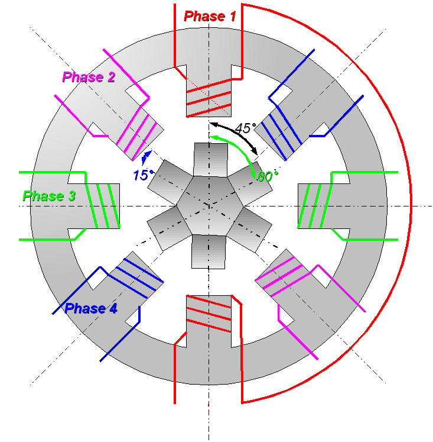
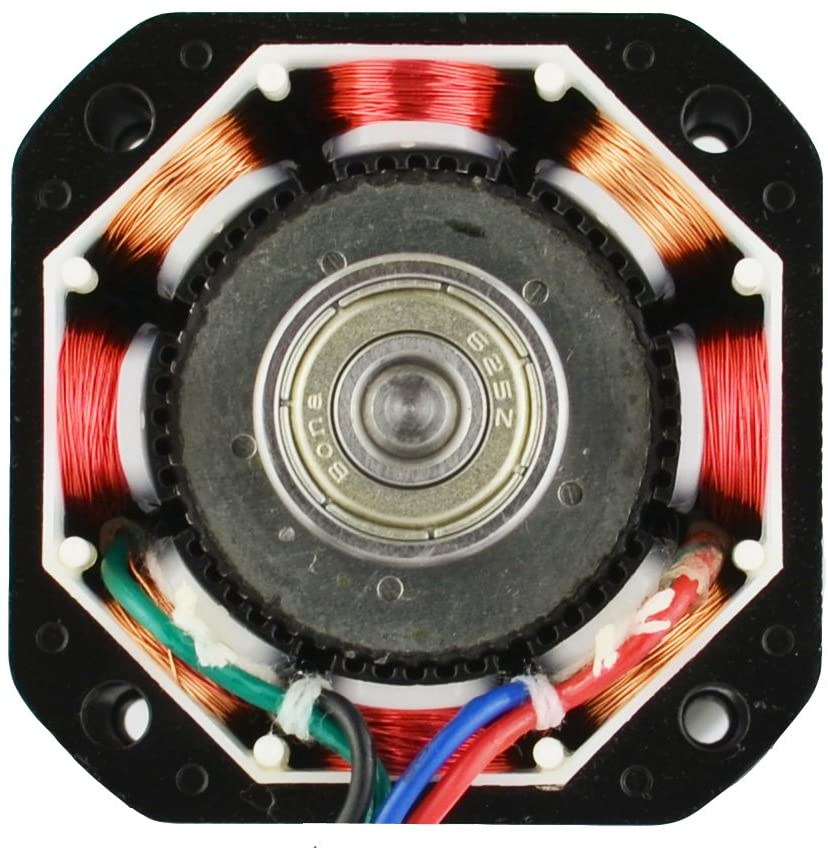

# Basis werking

## Wat is een stappenmotor
Een stappenmotor is een borstelloze synchrone gelijkstroommotor die digitale pulsen omzet in rotatie van een mechanische as.In tegenstelling tot veel andere standaardtypen motoren, draait een stappenmotor niet continu gedurende een bepaald aantal omwentelingen totdat de gelijkspanning die eraan wordt geleverd, wordt uitgeschakeld. Het heeft verschillende spoelen die in groepen zijn georganiseerd, de zogenaamde "fasen". Als elke fase beurtelings wordt ingeschakeld, draait de motor stap voor stap.

Stappenmotoren verdelen de gehele draaibeweging in meerdere gelijke stappen. Zolang de motor de juiste afmetingen heeft voor het koppel en de snelheid van de toepassing, kan de positie van de motor worden geregeld om in een van deze stappen te bewegen en daar te blijven zonder enige feedback van een positiesensor.

Bronnen:
(https://www.stepperonline.nl/stappenmotoren)
https://nl.wikipedia.org/wiki/Stappenmotor