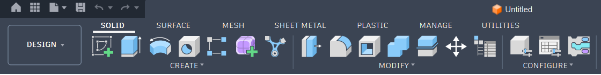
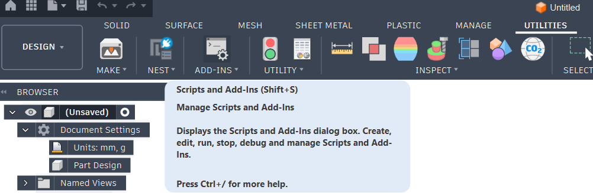
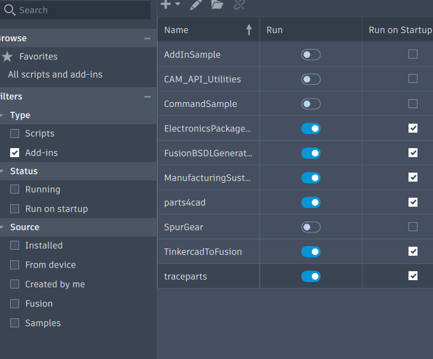
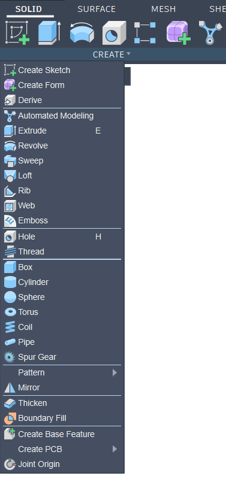
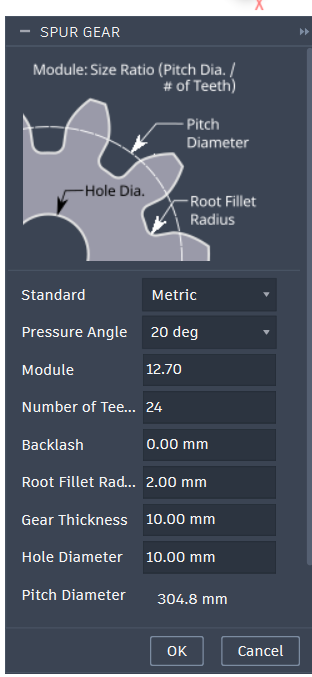
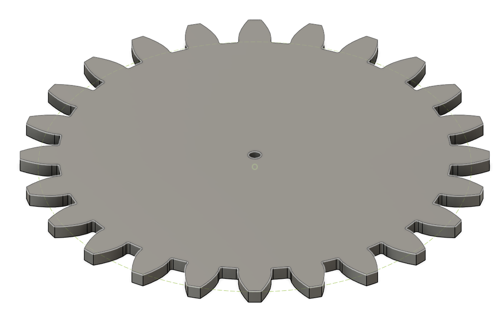

We werken met Fusion 360, 
voor een tandwiel te tekenen in fusion 360 zit dit standaard ingebouwd zodat je de nodige waarden moet ingeven van je tandwiel en die word dan gemaakt. 
Je kan dit doen aan de hand van de mode SpurGear (we moeten deze nog aanzetten).

Hoe zet ik SpurGear aan?
1. je maakt een nieuwe part design.
2. je gaat naar utilities 
3. nu klik je op "ADD-INS" 
4. nu moet je de ADD-IN  "SpurGear" aanzetten en aanvinken. 
5. Nu gaan we terug naar "Solid" 
6. We klikken dan op "CREATE" en dan op Spur Gear 
7. Je krijgt dan een venster met de nodige info die we moeten aanpassen voor een juiste tandwiel te krijgen. Hier moeten we onze eigen waarden invullen voor de nodige tandwiel. 
8. Als je dan waarden hebt ingegeven dan krijd je het volgende als resultaat: 